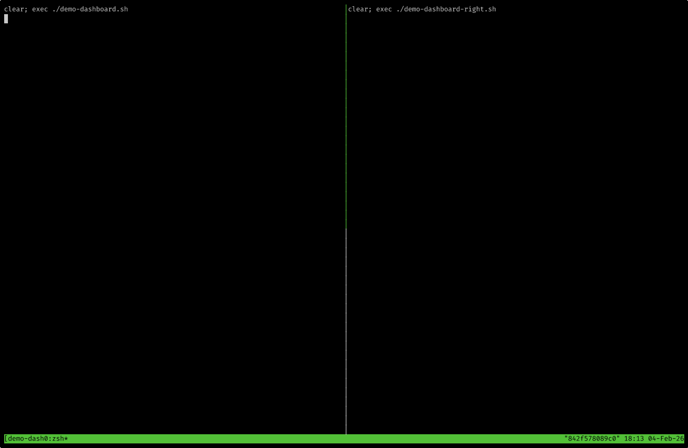

# vLLM Autoscaling Demo

Production-ready LLM inference on Amazon EKS with intelligent queue-based autoscaling.

## What You'll Learn

- **Queue-based scaling** - Why `num_requests_waiting` beats CPU metrics for LLM workloads
- **Fast cold starts** - Achieve ~2 minute GPU pod startup with SOCI + S3 streaming
- **Cost optimization** - Run on Spot instances with 60-70% savings
- **Karpenter + KEDA** - The right combination for GPU autoscaling

## Architecture

```
Users → CloudFront → ALB → FastAPI → vLLM Pods (GPU)
                                          ↓
                          KEDA (queue metrics) + Karpenter (GPU nodes)
                                          ↓
                                    S3 (model weights)
```

**Key components:**
- **vLLM** - High-performance LLM inference with OpenAI-compatible API
- **KEDA + Kedify** - Pod autoscaling based on request queue depth
- **Karpenter** - Just-in-time GPU node provisioning
- **SOCI** - Lazy container image loading for fast startup
- **S3 + Run:ai Streamer** - Model weight streaming (~750 MiB/s)

## Quick Start

### Prerequisites

```bash
# macOS
brew install terraform kubectl aws-cli docker jq tmux

# Verify AWS access
aws sts get-caller-identity
```

> **Note:** `tmux` is required for the split-screen terminal dashboard (`make dashboard`).

### Deploy (~30 minutes)

```bash
# 1. Configure
cp .demo-config.example .demo-config
# Edit terraform/terraform.tfvars with your region and project name

# 2. Create infrastructure
make setup-infra

# 3. Upload model to S3
make setup-model-s3

# 4. Build and push containers
make build-push-images

# 5. Deploy applications
make deploy-apps

# 6. Get the URL
make get-frontend-url
```

### Run the Demo

```bash
# Start load test + terminal dashboard
make run-demo

# Generate QR code for audience
make generate-qr
```



### Cleanup

```bash
make teardown
```

## Key Configuration

### KEDA ScaledObject

```yaml
triggers:
- type: kedify-otel
  metadata:
    metricQuery: 'sum(vllm_num_requests_waiting)'
    targetValue: '5'

advanced:
  scalingModifiers:
    formula: "running + (waiting * 10)"  # Weight queue heavily
    target: "25"
```

**Why this formula?** A single waiting request might be a blip, but `waiting × 10` means even a small queue triggers aggressive scaling. For LLM inference, queue depth is the enemy.

### Karpenter NodePool

```yaml
requirements:
- key: karpenter.sh/capacity-type
  operator: In
  values: ["spot", "on-demand"]
- key: karpenter.k8s.aws/instance-category
  operator: In
  values: ["g", "p"]
- key: karpenter.k8s.aws/instance-gpu-manufacturer
  operator: In
  values: ["nvidia"]
```

**Why these settings?** Allowing multiple GPU families (g4dn, g5, g6, p3) gives Karpenter more Spot options. The NVIDIA filter excludes AMD GPUs that don't work with vLLM's CUDA kernels.

## Documentation

| Document | Description |
|----------|-------------|
| [ARCHITECTURE.md](docs/ARCHITECTURE.md) | Component overview and design decisions |
| [SETUP.md](docs/SETUP.md) | Detailed deployment guide |
| [INFERENCE-ON-EKS.md](docs/INFERENCE-ON-EKS.md) | Deep dive into scaling and optimization |
| [diagrams.md](docs/diagrams.md) | Mermaid diagrams for presentations |

## Command Reference

| Command | Description |
|---------|-------------|
| `make setup-infra` | Create EKS + Karpenter + S3 |
| `make setup-model-s3` | Upload model to S3 |
| `make build-push-images` | Build and push containers |
| `make deploy-apps` | Deploy all applications |
| `make run-demo` | Start load test + dashboard |
| `make teardown` | Destroy everything |

## Results

- **Cold start**: ~2 minutes (from queue spike to serving)
- **Scaling**: 1→10 pods in a single decision
- **Cost**: 60-70% savings with Spot instances
- **Model**: Mistral 7B AWQ (4-bit, fits on T4 GPU)

## Troubleshooting

See [SETUP.md](docs/SETUP.md#troubleshooting) for common issues and solutions.
