# Architecture Diagrams

Diagrams for documentation and presentations. Render with any Mermaid-compatible tool or export to PNG/SVG.

---

## 1. High-Level Architecture

```mermaid
flowchart TB
    subgraph Users["👥 Users"]
        Mobile["📱 Mobile<br/>(QR Code)"]
        LoadGen["🔥 k6 Load Test"]
    end

    subgraph Edge["Edge Layer"]
        CF["☁️ CloudFront"]
        ALB["⚖️ ALB"]
    end

    subgraph Apps["Application Layer"]
        FE["🖥️ Frontend<br/>(Next.js)"]
        API["⚡ API Gateway<br/>(FastAPI)"]
    end

    subgraph Inference["Inference Layer"]
        vLLM1["🤖 vLLM Pod 1"]
        vLLM2["🤖 vLLM Pod 2"]
        vLLM3["🤖 vLLM Pod N"]
    end

    subgraph Scaling["Scaling Layer"]
        KEDA["📊 KEDA<br/>(Pod Scaling)"]
        Karpenter["🚀 Karpenter<br/>(Node Scaling)"]
    end

    subgraph Storage["Storage"]
        S3["🪣 S3<br/>(Model Weights)"]
    end

    Mobile --> CF
    LoadGen --> CF
    CF --> ALB
    ALB --> FE
    ALB --> API
    API --> vLLM1
    API --> vLLM2
    API --> vLLM3
    vLLM1 -.->|metrics| KEDA
    vLLM2 -.->|metrics| KEDA
    vLLM3 -.->|metrics| KEDA
    KEDA -->|scale pods| Inference
    Karpenter -->|provision nodes| Inference
    S3 -->|stream weights| vLLM1
    S3 -->|stream weights| vLLM2
    S3 -->|stream weights| vLLM3

    style Inference fill:#e1f5fe
    style Scaling fill:#fff3e0
    style Storage fill:#e8f5e9
```

---

## 2. Queue-Based Scaling Flow

```mermaid
flowchart LR
    subgraph Requests["Incoming Requests"]
        R1["Request 1"]
        R2["Request 2"]
        R3["Request 3"]
        R4["Request N"]
    end

    subgraph vLLM["vLLM Pod"]
        Queue["📥 Request Queue<br/>(num_requests_waiting)"]
        GPU["🎮 GPU Processing<br/>(num_requests_running)"]
        Metrics["📊 /metrics"]
    end

    subgraph KEDA["KEDA"]
        OTel["OTel Collector<br/>(2s scrape)"]
        Scaler["Kedify Scaler"]
        HPA["HPA Controller"]
    end

    subgraph Action["Scaling Action"]
        NewPod["🤖 New vLLM Pod"]
        NewNode["🖥️ New GPU Node"]
    end

    R1 --> Queue
    R2 --> Queue
    R3 --> Queue
    R4 --> Queue
    Queue --> GPU
    GPU --> Metrics
    Metrics -->|scrape| OTel
    OTel -->|query| Scaler
    Scaler -->|evaluate| HPA
    HPA -->|scale| NewPod
    NewPod -.->|triggers| NewNode

    style Queue fill:#ffcdd2
    style GPU fill:#c8e6c9
    style Scaler fill:#fff9c4
```

---

## 3. Cold Start Timeline

---

## 4. Traditional vs Queue-Based Scaling

```mermaid
flowchart TB
    subgraph Traditional["❌ Traditional HPA (CPU-based)"]
        direction LR
        T1["📥 Requests<br/>arrive"] --> T2["⏳ Queue<br/>builds"]
        T2 --> T3["😰 Latency<br/>spikes"]
        T3 --> T4["📈 CPU<br/>increases"]
        T4 --> T5["🔄 HPA<br/>scales"]
        T5 --> T6["🤖 New pod<br/>(too late)"]
    end

    subgraph QueueBased["✅ Queue-Based Scaling"]
        direction LR
        Q1["📥 Requests<br/>arrive"] --> Q2["📊 Queue<br/>detected"]
        Q2 --> Q3["🔄 KEDA<br/>scales"]
        Q3 --> Q4["🤖 New pod<br/>(proactive)"]
        Q4 --> Q5["✨ Latency<br/>stable"]
    end

    style Traditional fill:#ffebee
    style QueueBased fill:#e8f5e9
```

---

## 5. Karpenter + KEDA Interaction

---

## 6. Cost Optimization Stack

```mermaid
flowchart TB
    subgraph Savings["💰 Cost Savings"]
        Spot["🎯 Spot Instances<br/>60-70% savings"]
        AWQ["🗜️ AWQ Quantization<br/>75% less memory"]
        Scale["📉 Scale to Zero<br/>Pay only when used"]
        Fast["⚡ Fast Cold Starts<br/>Better utilization"]
    end

    subgraph Implementation["Implementation"]
        SpotImpl["NodePool: spot + on-demand"]
        AWQImpl["4-bit model fits on T4"]
        ScaleImpl["minReplicaCount: 0"]
        FastImpl["SOCI + S3 streaming"]
    end

    Spot --> SpotImpl
    AWQ --> AWQImpl
    Scale --> ScaleImpl
    Fast --> FastImpl

    style Savings fill:#e8f5e9
    style Implementation fill:#e3f2fd
```

---

## 7. SOCI vs Traditional Image Pull

---

## 8. S3 Model Streaming

```mermaid
flowchart LR
    subgraph S3["🪣 S3 Bucket"]
        Model["mistral-7b-awq/<br/>~4GB safetensors"]
    end

    subgraph Streamer["Run:ai Streamer"]
        Stream["Concurrent<br/>streaming<br/>~750 MiB/s"]
    end

    subgraph GPU["🎮 GPU"]
        VRAM["GPU Memory<br/>(direct load)"]
    end

    Model -->|"stream"| Stream
    Stream -->|"load"| VRAM

    style S3 fill:#fff3e0
    style GPU fill:#e8f5e9
```

---

## 9. Scaling Formula Visualization

```mermaid
flowchart TB
    subgraph Metrics["📊 vLLM Metrics"]
        Running["running = 20<br/>(requests processing)"]
        Waiting["waiting = 3<br/>(requests queued)"]
    end

    subgraph Formula["🧮 KEDA Formula"]
        Calc["running + (waiting × 10)<br/>= 20 + (3 × 10)<br/>= 50"]
    end

    subgraph Decision["📈 Scaling Decision"]
        Target["target = 25 per pod"]
        Result["50 / 25 = 2 pods needed"]
    end

    Running --> Calc
    Waiting --> Calc
    Calc --> Target
    Target --> Result

    style Formula fill:#fff9c4
    style Decision fill:#e8f5e9
```

---

## 10. Instance Type Selection

```mermaid
flowchart TB
    subgraph NodePool["Karpenter NodePool"]
        Req["Requirements:<br/>• category: g, p<br/>• gpu: nvidia<br/>• capacity: spot, on-demand"]
    end

    subgraph Options["Available Instances"]
        G4["g4dn.xlarge<br/>T4 16GB<br/>💰 Cheapest"]
        G5["g5.xlarge<br/>A10G 24GB<br/>⚡ Faster"]
        G6["g6.xlarge<br/>L4 24GB<br/>🔋 Efficient"]
        P3["p3.2xlarge<br/>V100 16GB<br/>📊 High BW"]
    end

    subgraph Selection["Karpenter Selects"]
        Best["Best available<br/>Spot instance"]
    end

    Req --> G4
    Req --> G5
    Req --> G6
    Req --> P3
    G4 --> Best
    G5 --> Best
    G6 --> Best
    P3 --> Best

    style NodePool fill:#e3f2fd
    style Selection fill:#e8f5e9
```

---

## Usage

### In GitHub/GitLab
These diagrams render automatically in markdown files.

### For Presentations
1. Use [Mermaid Live Editor](https://mermaid.live/) to export as PNG/SVG
2. Or use VS Code extension "Markdown Preview Mermaid Support"
3. Or use [Kroki](https://kroki.io/) for batch export

### Customization
- Change colors by modifying `style` declarations
- Adjust layout with `direction TB` (top-bottom) or `direction LR` (left-right)
- Add/remove nodes as needed
